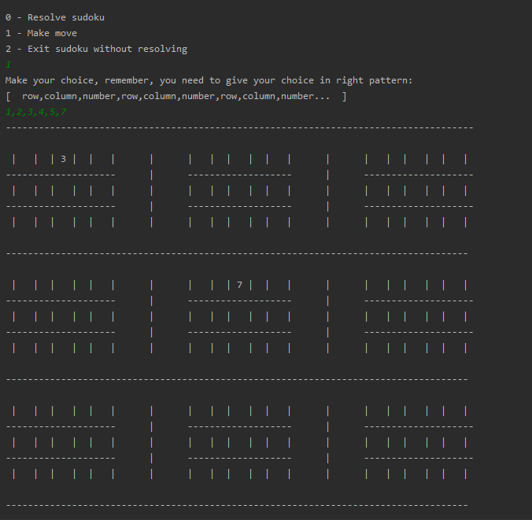
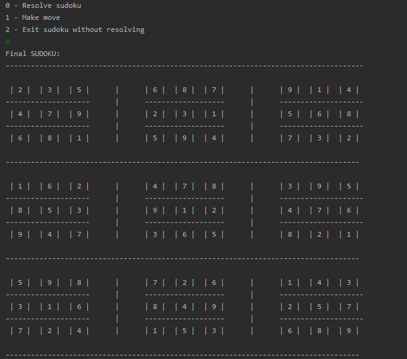

# SUDOKU CONSOLE GAME

## Table of contents
* [Introduction](##Introduction)
* [Screenshots](##Screenshots)
* [Technology](##Technology)
* [How to start up an application](##HowToStartUpAnApplication)

## Introduction
### Sudoku is a simple console game. 

#### In the game You can: 
* By click "0" on a keyboard - force an algorithm to resolve Sudoku.
* By click "1" on a keyboard - make choice, for example: "1,3,5" means that You want put a number 5
into row 1 and column 5. You can also do multiply choices for example: 3,4,5,6,7,8 means that You want put number 
5 into row 3 and column 5, and number 8 into row 6 and column 7. There is also an algorithm which validate your 
move in a case of errors like: the same number in one column, row or square. So don't worry about making mistakes :).
* By click "2" on a keyboard - leave sudoku game.

## Screenshots
You have an option to make a choice

or option to resolve sudoku board

## Technology
- Java 8
- JUnit
- Gradle

## How to start up an application
* First option - You should open the project in some IDE(Integrated development environment), 
for example IntelliJ IDEA or Eclipse. After this You should run a main method in SudokuGame class.
* Second option - You can open a game by a download only "Jar game run file" folder and run the game
by double-click on runSudoku.bat file.
